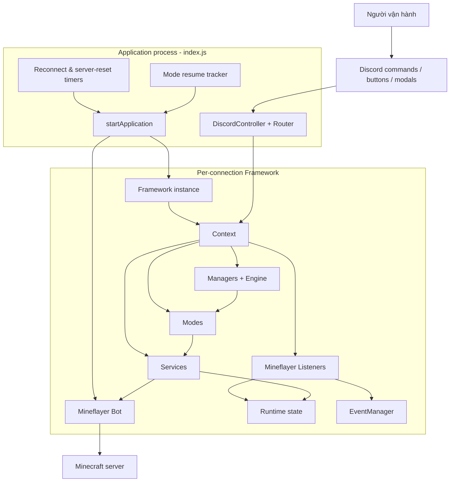
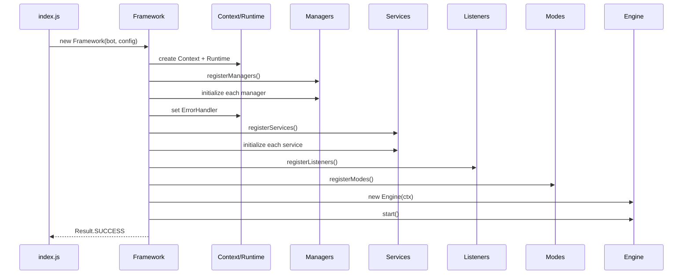
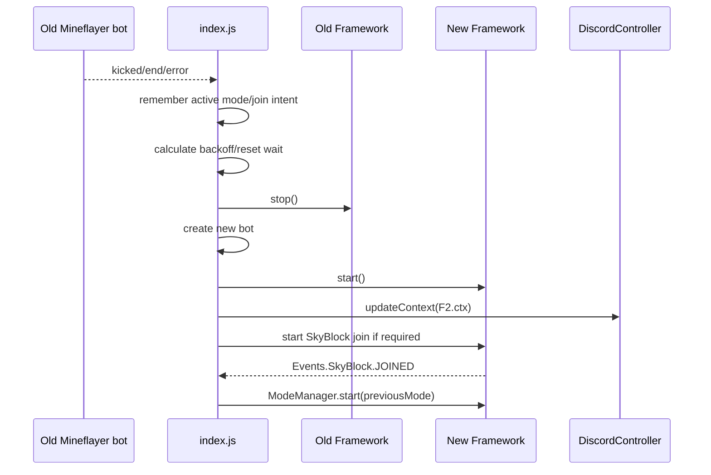
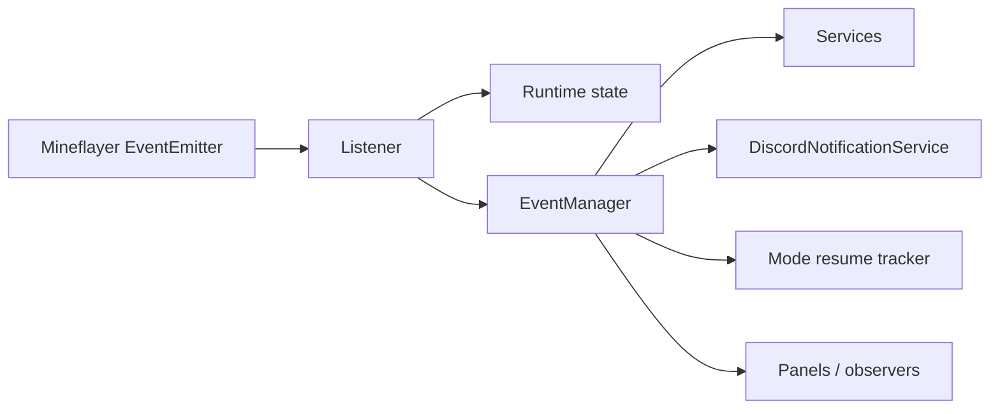
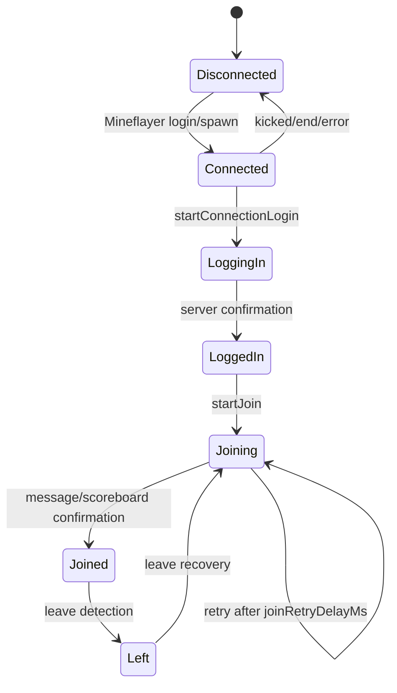
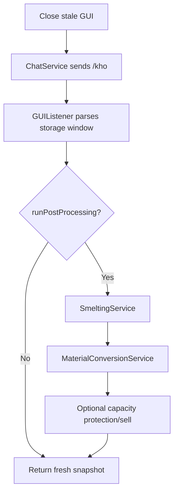
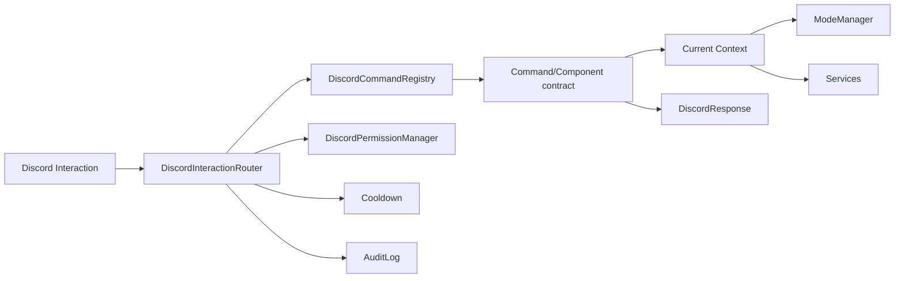
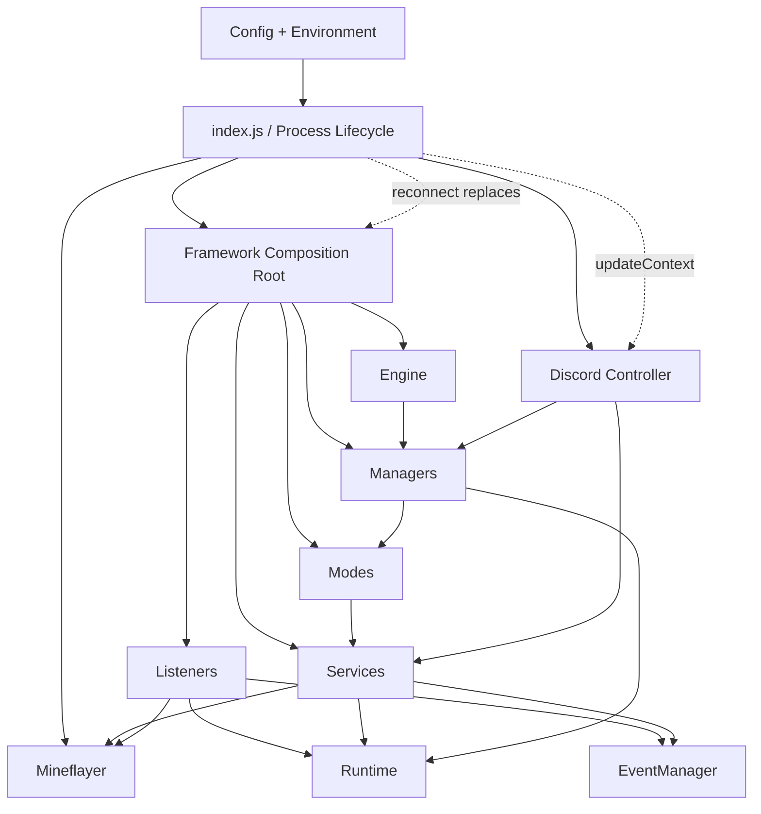

# Kiến trúc MCbot

> **Trạng thái:** As-built architecture — mô tả theo mã nguồn hiện tại  
> **Phiên bản tài liệu:** 2.0  
> **Ngày cập nhật:** 2026-08-01  
> **Runtime:** Node.js 22+, CommonJS, Mineflayer, discord.js

## 1. Mục đích tài liệu

Tài liệu này mô tả kiến trúc đang được triển khai trong repository MCbot, bao gồm:

- vòng đời process, Mineflayer connection và Framework;
- ranh giới trách nhiệm giữa Core, Manager, Listener, Service, Mode và Discord;
- luồng trạng thái, sự kiện và dependency injection;
- các workflow quan trọng: đăng nhập SkyBlock, Collector, Storage, Crafting, Dungeon, Fishing, reconnect và resume mode;
- quy tắc mở rộng, kiểm thử, bảo mật cấu hình và các giới hạn kỹ thuật hiện tại.

Mục tiêu chính là giúp người phát triển đọc code nhanh hơn, sửa đúng tầng, tránh tạo dependency vòng và không làm hỏng cơ chế recovery/reconnect.

> Khi tài liệu và code khác nhau, code là nguồn sự thật. Sau khi thay đổi kiến trúc hoặc contract public, cần cập nhật lại tài liệu này trong cùng pull request.

---

## 2. Tóm tắt kiến trúc

MCbot có **hai phạm vi vòng đời** khác nhau:

1. **Application/process scope** do `index.js` quản lý. Phạm vi này sống xuyên suốt process, tạo Mineflayer bot, lên lịch reconnect/server reset, giữ mode cần tiếp tục và duy trì Discord Controller.
2. **Connection/framework scope** do `Framework.js` quản lý. Mỗi Mineflayer connection có một `Context`, `Runtime`, bộ Manager, Service, Listener, Mode và Engine riêng. Khi reconnect, framework cũ bị destroy và framework mới được tạo.



### Nguyên tắc trung tâm

- `index.js` quản lý **process lifecycle**, không phải gameplay workflow.
- `Framework` lắp ráp dependency và quản lý lifecycle của một connection.
- `Engine` chạy vòng tick tuần tự, không chứa nghiệp vụ Minecraft.
- `Mode` sở hữu workflow dài hạn và chỉ có một mode active tại một thời điểm.
- `Service` cung cấp capability hoặc workflow theo domain; service được phép phối hợp service khác qua `Context` khi cần.
- `Listener` chuyển Mineflayer event thành runtime state và framework event.
- Discord là control plane; command/component gọi Manager hoặc Service, không gọi Mineflayer trực tiếp.
- `Runtime` là trạng thái vận hành dùng chung của một framework instance.
- `EventManager` giảm coupling giữa nguồn sự kiện và consumer.

---

## 3. Cấu trúc thư mục

```text
MCbot-main/
├── index.js                       # Process orchestration, reconnect, server reset
├── Framework.js                   # Composition root của một Mineflayer connection
├── bootstrap/                     # Đăng ký Manager, Service, Listener, Mode
├── core/
│   ├── base/                      # BaseManager, BaseService, BaseListener, BaseMode
│   ├── constants/                 # Events, Result, States, Priorities
│   ├── context/Context.js         # Dependency injection container
│   ├── engine/Engine.js           # Tick loop
│   ├── errors/                    # BotError, TimeoutError, ErrorHandler
│   ├── managers/                  # Infrastructure managers
│   └── runtime/                   # Runtime wrapper và factory
├── listeners/                     # Mineflayer event adapters
├── services/                      # Minecraft/domain capabilities
├── modes/                         # Long-running workflows
├── discord/                       # Discord control plane
│   ├── commands/                  # Slash-command contracts
│   ├── components/                # Button/select/modal handlers
│   ├── middleware/                # Permission-adjacent audit/cooldown
│   ├── notifications/             # Framework event -> Discord notification
│   ├── embeds/                    # Dashboard presentation
│   └── constants/                 # Custom IDs, colors, permissions
├── config/config.example.json     # Gameplay/non-secret configuration template
├── scripts/                       # Command registration, smoke test
├── test/                          # node:test suites
└── utils/                         # Cross-domain helpers
```

---

## 4. Dependency và ranh giới tầng

### 4.1 Dependency hợp lệ

| Caller | Có thể phụ thuộc vào | Ghi chú |
|---|---|---|
| `index.js` | Mineflayer, Framework, DiscordController, process timers | Composition root cấp process |
| `Framework.js` | Context, Runtime, Engine, bootstrap, ErrorHandler | Composition root cấp connection |
| Engine | ModeManager, WatchdogManager, RecoveryManager, SchedulerManager | Chỉ điều phối tick |
| Manager | Context, Runtime, constants; Manager/Service/Mode qua Context khi đúng trách nhiệm | Không import implementation domain trực tiếp |
| Mode | Service và một số Manager qua Context | Sở hữu workflow dài hạn |
| Service | Bot, Runtime, Manager, Service khác qua Context | Không import implementation service khác trực tiếp |
| Listener | Bot, Runtime, EventManager; service đồng bộ hẹp khi cần | Không khởi động mode/workflow dài hạn |
| Discord handler | Manager/Service qua Context | Không gọi `bot.chat`, `clickWindow`, pathfinder trực tiếp |

Ví dụ dependency qua Context:

```js
const storage = this.service('storage');
const events = this.manager('events');
const modeManager = ctx.getManager('mode');
```

### 4.2 Dependency bị cấm

- Service hoặc Listener import trực tiếp class Mode.
- Mode import trực tiếp Mode khác.
- Discord command/component thao tác `ctx.bot` để chat, click GUI, di chuyển hoặc thay inventory.
- Domain code tạo `Context`, `Runtime` hoặc `Framework` mới.
- Service gọi `Engine.start()`/`Engine.stop()`.
- Module giữ singleton mutable toàn process cho trạng thái connection.
- Consumer sửa Map registry (`ctx.services`, `ctx.managers`, `ModeManager.modes`) ngoài composition/bootstrap.
- Dùng event name tự do thay vì `core/constants/Events.js` khi event đã có contract.

### 4.3 Lưu ý về dependency qua Context

Không import chéo implementation không có nghĩa là không có dependency. `this.service('storage')` vẫn là dependency runtime. Khi thêm dependency mới cần:

1. bảo đảm service được đăng ký trước khi consumer bắt đầu sử dụng;
2. tránh chu trình gọi đồng bộ hoặc chờ Promise lẫn nhau;
3. ghi dependency vào tài liệu/module comment;
4. ưu tiên event nếu consumer chỉ cần phản ứng với một thay đổi, không cần kết quả trả về trực tiếp.

---

## 5. Vòng đời application và framework

### 5.1 Khởi động process

`startApplication()` trong `index.js` thực hiện theo thứ tự:

1. đọc `.env` và `config/config.json` bằng `loadConfig()`;
2. override cấu hình Minecraft và toàn bộ Discord secret/process setting từ biến môi trường;
3. validate `minecraft.host`, `minecraft.username` và Discord credential bắt buộc;
4. tạo Mineflayer bot bằng `mineflayer.createBot(config.minecraft)`;
5. load plugin `mineflayer-pathfinder`;
6. tạo `Framework(bot, config)` và gọi `framework.start()`;
7. đăng ký động `BotLifecycleService` để Discord có thể yêu cầu connect/restart/shutdown;
8. bật prismarine viewer nếu được cấu hình;
9. gắn listener `kicked`, `end`, `error` cấp process để lên lịch reconnect;
10. khởi động Discord Controller nếu `DISCORD_ENABLED=true`;
11. lên lịch server reset;
12. gắn `SIGINT`/`SIGTERM` để shutdown có kiểm soát.

### 5.2 Khởi động một Framework instance

`Framework.start()` là composition sequence bắt buộc:



Thứ tự này quan trọng vì:

- Logger phải tồn tại trước Manager/Service khác.
- EventManager và SchedulerManager phải sẵn sàng trước Service bind event hoặc chờ timer.
- ErrorHandler cần Logger, Runtime và EventManager.
- Listener cần Service/Manager đã được đăng ký.
- Mode cần Service đã sẵn sàng.
- Engine chỉ bắt đầu sau khi toàn bộ graph đã lắp xong.

### 5.3 Dừng Framework

`Framework.stop()` dừng theo chiều ngược dependency:

1. dừng Engine và chờ loop kết thúc;
2. destroy Listener theo thứ tự đảo;
3. destroy Service theo thứ tự đảo;
4. destroy Manager theo thứ tự đảo;
5. reset Runtime tại chỗ;
6. bỏ reference Engine và đánh dấu framework đã dừng.

Việc reset tại chỗ giữ nguyên identity của `runtime.state` trong thời gian teardown, nhưng sau reconnect một `Framework/Runtime` mới vẫn được tạo.

### 5.4 Reconnect và thay Context

Reconnect thuộc `index.js`, không thuộc `RecoveryManager`.



`DiscordController` được giữ lại qua reconnect; nó thay `ctx`, permission config, notification bindings và panel context bằng `updateContext()`.

---

## 6. Core runtime model

### 6.1 Context

`Context` là dependency injection container duy nhất trong một Framework instance. Các field chính:

```text
ctx.bot
ctx.config
ctx.runtime
ctx.logger
ctx.errorHandler
ctx.engine
ctx.managers[name]
ctx.services[name]
ctx.modes[name]
ctx.listeners
ctx.discordController
```

`registerManager()` và `registerService()` đồng thời tạo shortcut `ctx[name]`. Code mới nên ưu tiên `getManager()`/`getService()` để dependency rõ ràng hơn.

### 6.2 Runtime

`Runtime` bọc một object mutable được tạo bởi `RuntimeFactory`. Nó cung cấp:

- `state`: reference trạng thái hiện tại;
- `reset()`: xóa và gán lại field trên cùng object;
- `snapshot()`/`toJSON()`: JSON clone phục vụ debug khi state có thể serialize.

Runtime hiện tại có cả dữ liệu primitive và reference Mineflayer tạm thời như `player.entity`, `gui.window`. Vì vậy Runtime là **operational state**, không phải database hoặc event log; snapshot không nên được xem là cơ chế persistence đáng tin cậy cho mọi thời điểm.

### 6.3 Các namespace Runtime

| Namespace | Nội dung chính | Owner cập nhật chủ yếu |
|---|---|---|
| `bot` | connected, reconnecting, sessionId | ConnectionListener/process lifecycle |
| `connection` | state, reconnect count, kick/disconnect | ConnectionListener |
| `engine` | running, state, tick, lastError | Engine/ErrorHandler |
| `player` | identity, entity, health, food, position, dead | PlayerListener/PlayerService |
| `skyblock` | login/join/island/workflow diagnostics | SkyBlockService |
| `gui` | window, title, slots, last update | GUIListener/GUIService |
| `chat` | last command, GUI-close cooldown | ChatService |
| `inventory` | item snapshot, empty slots, full, held item | InventoryListener/InventoryService |
| `mode` | current, previous, state | BaseMode/ModeManager |
| `recovery` | required, running, reason | Watchdog/RecoveryManager |
| `watchdog` | enabled, heartbeat/tick state | WatchdogManager |
| `collector` | collecting, pause, counters, GUI backoff | CollectorService/CollectorMode |
| `storage` | parsed `/kho`, capacity, sell state | GUIListener/StorageService |
| `smelting` | `/ks` smelting pass status | SmeltingService |
| `materialConversion` | pack/unpack workflow | MaterialConversionService |
| `personalVault` | `/pv 2` snapshot/transfers/cooldown | PersonalVaultService |
| `crafting` | plan progress, ledger, retries, partial state | CraftingService |
| `dungeon` | run/death/respawn state | DungeonService |
| `fishing` | fishing run state | FishingService |
| `mining` | mining state/tool | MiningService |
| `task`, `metrics` | generic task/metric placeholders | Các module tương ứng |

### 6.4 Constants và contract trả về

- `Result.js`: contract kết quả nghiệp vụ dạng string như `SUCCESS`, `PENDING`, `RETRY`, `GUI_TIMEOUT`, `NOT_CONNECTED`, `BUSY`.
- `States.js`: state machine constants theo domain.
- `Events.js`: tên event chuẩn `<domain>.<action>`.
- `Priorities.js`: thang ưu tiên định nghĩa sẵn; hiện không phải scheduler ưu tiên thực thi.

Quy tắc:

- Trường hợp nghiệp vụ có thể dự đoán trả về `Result`, không dùng exception.
- Exception dành cho programming error, dependency/config invalid hoặc lỗi bất ngờ.
- Caller phải xử lý rõ các kết quả trung gian như `PENDING`, `ALREADY_DONE`, `NO_ACTION`, `RETRY`.

---

## 7. Base classes

### 7.1 BaseManager

Cung cấp Context/Runtime/config/logger, lifecycle `initialize()`/`destroy()`, lookup Manager/Service/Mode và logging helper. Manager chịu trách nhiệm hạ tầng hoặc điều phối framework-level.

### 7.2 BaseService

Cung cấp dependency, lifecycle, event binding tự dọn qua `_bindings`, lookup Manager/Service/Mode, logging và `emit()`. Service con phải dọn timer, pending operation và listener riêng trong `destroy()`.

### 7.3 BaseListener

Cung cấp `bind()` để lưu binding và `unregister()` an toàn. Listener con phải gọi `super.register()` và chỉ làm việc ngắn khi Mineflayer phát event.

### 7.4 BaseMode

Giữ state `running`, `paused`, `modeState`, `startedAt`, recovery flag; chuẩn hóa `start`, `stop`, `pause`, `resume`, `tick`, `recover`. Mode con được phép override nhưng phải giữ invariant của `super`.

---

## 8. Managers và Engine

### 8.1 Danh sách Manager

| Registry key | Class | Trách nhiệm |
|---|---|---|
| `logger` | `LoggerManager` | log level, timestamp, dedupe, recent in-memory entries |
| `events` | `EventManager` | event bus, `on/once/off/emit/waitFor` |
| `scheduler` | `SchedulerManager` | timeout/interval có ID, sleep, cleanup |
| `mode` | `ModeManager` | registry và exclusive active mode |
| `recovery` | `RecoveryManager` | recovery trong cùng connection |
| `watchdog` | `WatchdogManager` | phát hiện player dead/mode recovery request |

Không có `PluginManager` riêng trong implementation hiện tại. Pathfinder được load ở `index.js`.

### 8.2 Engine loop

Engine chạy một loop khoảng **50 ms/tick** và await tuần tự:

```text
WatchdogManager.tick()
        ↓
RecoveryManager.tick()
        ↓
ModeManager.tick()
        ↓
SchedulerManager.sleep(50)
```

Đặc tính:

- Không có hai `Mode.tick()` do Engine khởi chạy chồng nhau.
- Một tick dài sẽ kéo dài chu kỳ thực tế; 50 ms là delay sau tick, không phải hard real-time cadence.
- Watchdog/recovery được xử lý trước mode bình thường.
- Lỗi ngoài dự kiến được chuyển qua `ErrorHandler`, Engine tiếp tục loop nếu còn running.

### 8.3 ModeManager invariant

- Chỉ một `currentMode`.
- Start mode mới sẽ stop mode cũ trước.
- Nếu `mode.start()` thất bại, current mode được dọn và runtime được đồng bộ.
- Pause giữ current mode nhưng Engine không gọi tick.
- Start/stop/pause/resume thành công phát event tương ứng.

---

## 9. Listener và event flow

### 9.1 Listener đang đăng ký

| Listener | Mineflayer signals chính | Output |
|---|---|---|
| `ConnectionListener` | login, spawn, end, kicked, error, resourcePack | connection/bot runtime + connection events |
| `PlayerListener` | health, death, respawn, move, experience | player runtime + player events |
| `InventoryListener` | inventory/slot updates | gọi sync hẹp của InventoryService |
| `GUIListener` | window open/close/update slot | GUI runtime, parse `/kho`, GUI events |
| `ChatListener` | message/action bar/chat | normalized text + player/chat events |
| `MovementListener` | goal reached/path events | movement events/runtime |

### 9.2 Event data flow



Event handler phải:

- nhanh, có timeout nếu chờ I/O;
- không tạo loop vô hạn;
- unsubscribe trong `destroy()`/`stop()`;
- không giả định thứ tự event giữa connection cũ và connection mới; dùng `sessionId` hoặc connection generation khi cần.

---

## 10. Service catalog

### 10.1 Gateway và capability services

| Service | Capability chính |
|---|---|
| `ChatService` | gateway chat/command; serialize slash command; giữ cooldown sau khi GUI đóng |
| `GUIService` | đọc window hiện tại, wait open, close, click slot |
| `InventoryService` | snapshot, find/count, use/equip/drop/swap |
| `MovementService` | pathfinder goto/follow/look/jump/stop, stuck diagnostics |
| `PlayerService` | health/food/position/entity/nearby players |
| `MiningService` | equip/dig/stop mining |
| `ViewService` | viewer URL và capture/view support |
| `ConfigurationService` | update và persist gameplay config an toàn |
| `BotLifecycleService` | adapter callback cấp process cho connect/restart/shutdown |

### 10.2 Domain/workflow services

| Service | Workflow/domain |
|---|---|
| `SkyBlockService` | resource pack, login, join menu, island, leave detection/recovery request |
| `CollectorService` | nhặt item và state collector cơ bản |
| `StorageService` | đọc `/kho`, capacity, sell, chuẩn bị raw/capacity cho crafting |
| `SmeltingService` | workflow nung raw qua `/ks` |
| `MaterialConversionService` | pack/unpack block ↔ vật liệu |
| `PersonalVaultService` | refresh/withdraw/deposit `/pv 2`, reserve inventory slots |
| `CraftingService` | material ledger, recipe planning, partial/shift/bulk craft, click acknowledgement |
| `DungeonService` | vào `/d`, AutoFarm, combat/eat/equip, death/reentry |
| `FishingService` | mở `/afk`, chọn slot, di chuyển target, equip rod/cast |
| `GuiProbeService` | chẩn đoán GUI và slot phục vụ vận hành/debug |

### 10.3 Service composition

Implementation hiện tại dùng composition giữa service, ví dụ:

- `StorageService` → Chat, GUI, Inventory, Smelting, MaterialConversion, PersonalVault.
- `CraftingService` → Chat, GUI, Inventory, Storage, MaterialConversion, PersonalVault.
- `SkyBlockService` → Chat, GUI, Events, Scheduler, Recovery.
- `DungeonService` → Chat, GUI, Inventory, Movement, Events.

Đây là dependency hợp lệ khi service cấp cao hơn đang điều phối một workflow theo domain. Không được tạo cycle, ví dụ A await B trong khi B await A.

---

## 11. Mode catalog

| Registry name | Class | Workflow chính | Recovery |
|---|---|---|---|
| `collector` | `CollectorMode` | join → island → pickup position → collect → storage maintenance → SHK cycle | join/island lại, stop movement, về pickup, resume collector |
| `dungeon` | `DungeonMode` | join/island → start DungeonService → enter `/d` → tick combat/automation | tôn trọng delayed reentry; respawn/resume khi phù hợp |
| `fishing` | `FishingMode` | join/island → `/afk` → chọn slot → di chuyển/câu | stop và start lại fishing location workflow |
| `super-alloy` | `SuperAlloyMode` | chạy CraftingService tới khi hoàn tất → deposit `/pv 2` | không có recovery đặc thù ngoài base/current connection |

`collector` đã tích hợp chu kỳ chế tạo Siêu Hợp Kim; `super-alloy` là mode chạy crafting độc lập.

---

## 12. Workflow SkyBlock

SkyBlockService là state machine connection/login/join. Các bước thực tế có thể gồm:

1. chờ Mineflayer connection/spawn;
2. chấp nhận resource pack;
3. gửi `/login <password>` tối đa một lần cho connection generation;
4. gửi `/skyblock` hoặc command cấu hình;
5. chờ GUI mới;
6. click server slot, sau đó island slot với retry;
7. xác nhận đã vào bằng message/scoreboard/event;
8. theo dõi việc rời SkyBlock và yêu cầu recovery sau delay.



Một server kick trong lúc join được xử lý khác kick khi connection đang ổn định: `index.js` chọn delay reconnect ngắn theo `skyblock.joinRetryDelayMs` hoặc delay kick dài theo `minecraft.kickReconnectDelayMs`.

---

## 13. Workflow Collector – Storage – Crafting

### 13.1 Collector orchestration

CollectorMode bảo đảm:

- bot đã vào SkyBlock và về island;
- bot tới `collector.pickupPosition` trước khi mở `/pv`, `/kho` hoặc `/ks`;
- không mở `/kho` khi CraftingService đang dùng `/ks`;
- khi inventory đầy, chạy maintenance `/kho` trước khi pause để tránh deadlock;
- kiểm tra vị trí định kỳ và quay lại điểm nhặt;
- áp dụng GUI backoff khi server không phản hồi.

### 13.2 Storage refresh pipeline

Một lượt refresh có thể chạy:



Collector thường đọc `/kho` lần đầu để thực hiện post-processing, sau đó đọc lại không mutation để dashboard, capacity và quyết định sell phản ánh trạng thái mới nhất.

### 13.3 Crafting pipeline

CraftingService là service lớn nhất và quản lý state machine riêng:

1. đọc inventory;
2. audit/rút nguyên liệu từ `/pv 2` nếu bật;
3. đọc và đánh giá storage;
4. tạo material ledger theo alias/config;
5. lập recipe plan tới target slot/count;
6. tách phần có thể craft ngay nếu partial craft bật;
7. chuẩn bị raw/unpack/capacity trước action;
8. mở `/ks`, đi vào menu recipe;
9. click action, chờ inventory/GUI acknowledgement và retry giới hạn;
10. re-plan khi shift craft hoặc inventory pressure làm số lượng thay đổi;
11. hoàn tất, trả diagnostic/result;
12. deposit SHK hoặc intermediate recovery items vào `/pv 2` theo policy.

### 13.4 Quyền sở hữu GUI và command channel

- `ChatService` serialize tất cả slash command bằng Promise queue.
- Sau `windowClose`, slash command tiếp theo chờ `minecraft.commandAfterGuiCloseDelayMs`.
- Mode/workflow phải đóng GUI cũ trước khi mở domain GUI mới.
- Collector dùng `craftingActive` để tránh `/kho` cắt ngang `/ks`.
- Chưa có global GUI mutex object; exclusivity hiện được bảo đảm bằng orchestration convention và state flags. Tính năng mới phải giữ convention này hoặc bổ sung một lock thống nhất.

---

## 14. Dungeon và Fishing

### 14.1 Dungeon

DungeonMode gọi DungeonService cho:

- mở menu `/d`, chọn entry slot;
- bật AutoFarm qua command/menu cấu hình;
- theo dõi death/respawn;
- tự ăn theo health/food threshold;
- equip weapon/offhand và chọn combat target;
- phát hiện teleport bất ngờ hoặc spawn return;
- lên lịch reentry sau reconnect, SkyBlock leave hoặc forced move.

Delayed reentry thuộc DungeonService; RecoveryManager không được ép state RUNNING khi timer reentry còn pending.

### 14.2 Fishing

FishingService thực hiện:

- mở `/afk`, chọn một slot từ cấu hình;
- xác định target theo `slotTargets`;
- ưu tiên MovementService/pathfinder;
- có direct sprint/jump fallback và unstuck logic;
- tránh block nguy hiểm theo config;
- tìm/equip cần câu và cast;
- chờ GUI/teleport bằng timeout.

Recovery khởi động lại toàn bộ fishing workflow vì vị trí AFK gắn với location server, không chỉ resume target cũ.

---

## 15. Recovery và resilience

### 15.1 Recovery trong cùng connection

Luồng:

```text
Mode/Watchdog phát hiện bất thường
        ↓
mode.requestRecovery(reason)
        ↓
WatchdogManager.request RecoveryManager
        ↓
RecoveryManager.ensureJoined()
        ↓
ModeManager.recover()
        ↓
Mode tự khôi phục domain-specific state
```

RecoveryManager không biết chi tiết Collector/Dungeon/Fishing; chi tiết nằm trong `mode.recover()` và service domain.

### 15.2 Reconnect cấp process

`index.js` xử lý socket loss bằng:

- lock `reconnectTimer` + `reconnecting` để tránh hai connection song song;
- exponential backoff cho lỗi mạng thông thường;
- delay riêng cho server kick ổn định;
- delay ngắn nếu kick xảy ra trong SkyBlock join;
- server-reset wait window;
- mode resume tracker nằm ngoài Framework;
- giữ join intent xuyên qua framework replacement;
- cập nhật Discord Controller sang Context mới.

### 15.3 Scheduled server reset

`serverReset.hours`, timezone, pre-wait và wait window được tính ở process layer. Khi đến reset:

1. remember mode/join intent;
2. schedule reconnect với `joinSkyblock=true`;
3. chủ động quit connection hiện tại;
4. reconnect sau cửa sổ reset;
5. join SkyBlock và resume mode nếu cần.

### 15.4 Error handling

`ErrorHandler`:

- chuẩn hóa lỗi thành `BotError`;
- ghi `runtime.engine.lastError`;
- log theo config;
- emit `Events.Engine.ERROR`;
- không tự retry/reconnect/recover.

Retry policy phải nằm ở owner của operation: process reconnect, SkyBlock join, GUI service/domain service hoặc Mode.

---

## 16. Discord control plane

### 16.1 Thành phần



- `DiscordController`: client lifecycle, contract registration, context replacement.
- `DiscordCommandRegistry`: command và component lookup, matcher cho dynamic IDs.
- `DiscordInteractionRouter`: permission, cooldown, Minecraft readiness, defer, error handling, audit.
- `DiscordPermissionManager`: `VIEWER < MODERATOR < ADMIN < OWNER`.
- `ControlPanelManager`: duy trì một control panel và live status.
- `ConfigPanelManager`: duy trì gameplay config panel.
- `DiscordNotificationService`: map framework events sang notification/error channel với dedupe 30 giây.
- `InventorySessionManager` và `ConfirmationManager`: state ngắn hạn cho component flow.

### 16.2 Contract command/component

Một handler thường khai báo:

```js
{
  data,                 // slash command data, nếu là command
  permission,           // VIEWER/MODERATOR/ADMIN/OWNER
  cooldown,
  minecraftRequired,
  defer,
  ephemeral,
  execute(ctx, interaction)
}
```

Handler phải gọi `ctx.getManager(...)` hoặc `ctx.getService(...)`. Mọi response đi qua `DiscordResponse` để thống nhất ephemeral/embed/truncation.

### 16.3 Context qua reconnect

Router lấy Context bằng callback `getContext: () => this.ctx`, nên interaction mới luôn dùng Context hiện tại. Khi reconnect, `updateContext()` rebind notification và cập nhật panel; không tạo Discord client mới.

---

## 17. Configuration và bảo mật

### 17.1 Nguồn cấu hình

| Nguồn | Nội dung |
|---|---|
| `.env` | Discord token/IDs/roles/channels, Minecraft host/user/auth/version, SkyBlock password |
| `config/config.json` | gameplay slots, commands, delays, timeout, coordinates, crafting recipes, storage/fishing/dungeon/viewer/logging |
| `config/config.example.json` | template có thể commit |

`loadConfig()` không fallback Discord secret từ JSON. `skyblock.loginPassword` chỉ đến từ environment.

### 17.2 Persist từ Config Panel

`ConfigurationService` chỉ lưu các editable root đã whitelist và xóa `discord` cùng `skyblock.loginPassword` khỏi JSON khi save. Path có độ sâu giới hạn và type mới phải khớp type cũ, trừ một số optional root.

### 17.3 Config-driven rule

Những giá trị phụ thuộc server phải ở config khi có thể:

- command;
- GUI slot/button;
- item alias;
- coordinate/radius;
- timeout/retry/delay;
- threshold và target list;
- recipe graph.

Hardcode chỉ phù hợp cho default fallback được ghi rõ và có validation/bounds.

### 17.4 Phạm vi server-specific

Framework core có thể tái sử dụng, nhưng domain hiện tại gắn mạnh với MinerUA/SkyBlock qua command, GUI title/slot, scoreboard và recipe. Port sang server khác cần thay config và có thể phải thay parser/workflow service; không nên xem toàn bộ project là server-agnostic tuyệt đối.

---

## 18. Concurrency, timeout và cleanup

### 18.1 Invariant concurrency

- Một Engine loop cho mỗi Framework.
- Một active Mode.
- Slash command Minecraft được serialize.
- Reconnect được khóa ở process layer.
- Discord interaction có thể đến đồng thời; service phải tự bảo vệ state như `selling`, `active`, `running`, `reconnecting`.
- GUI workflow không nên chạy song song.

### 18.2 Timeout

Mọi operation chờ external state cần timeout:

- GUI open/change;
- teleport/arrival;
- login/join confirmation;
- Discord ready;
- click acknowledgement;
- slot readiness.

Timeout nghiệp vụ trả `Result.TIMEOUT`/domain timeout khi có thể; exception timeout dùng khi API chờ Promise được thiết kế reject.

### 18.3 Timer ownership

- Framework timer có ID và cần hủy khi destroy; ưu tiên SchedulerManager.
- Process timers (`reconnectTimer`, `resetTimer`) thuộc `index.js` và được clear trong `application.stop()`.
- Một số domain code dùng native `setTimeout`/`setInterval`; owner vẫn phải giữ/cancel hoặc bảo vệ bằng connection generation/state flag.
- Không để timer từ Context cũ thao tác Context mới.

### 18.4 Event binding cleanup

Dùng:

- `BaseService.bind()` + `super.destroy()`;
- `BaseListener.bind()` + `destroy()`;
- danh sách binding riêng và `off()` trong các class không kế thừa base phù hợp.

---

## 19. Logging, diagnostics và observability

- Logger level: `DEBUG`, `INFO`, `SUCCESS`, `WARN`, `ERROR`, `SILENT`.
- Timestamp dùng timezone cấu hình; default `Asia/Ho_Chi_Minh`.
- Message giống nhau được dedupe ngắn để giảm spam.
- 500 log entry gần nhất được giữ trong memory cho Discord log commands.
- ErrorHandler lưu lỗi Engine gần nhất vào Runtime.
- GUIListener có parser và diagnostic cho storage detail/NBT.
- `GuiProbeService` cho phép quan sát GUI/slot theo action có kiểm soát.
- Dashboard đọc Runtime và service snapshot; không nên tự suy diễn gameplay bằng cách gọi Mineflayer.
- Discord notification dedupe 30 giây theo event key.

Không log token, password, auth secret hoặc nội dung nhạy cảm từ `.env`.

---

## 20. Testing và validation

Project dùng `node:test`:

```bash
npm test
npm run test:discord
npm run smoke
```

Các lớp test hiện tại bao phủ:

- lifecycle/framework/runtime/manager/service/mode contracts;
- configuration persistence và protected paths;
- Discord registry/router/permission/panel/commands;
- nhiều workflow domain và edge case qua test doubles.

Khi thay đổi kiến trúc:

1. chạy toàn bộ `npm test`;
2. chạy smoke test;
3. nếu sửa slash command contract, chạy script đăng ký command ở môi trường phù hợp;
4. test reconnect và context replacement nếu sửa `index.js`, lifecycle hoặc Discord Controller;
5. test cleanup để phát hiện listener/timer leak.

---

## 21. Hướng dẫn mở rộng

### 21.1 Thêm Service

1. tạo `services/XService.js` kế thừa `BaseService`;
2. khai báo owner state và dependency qua Context;
3. triển khai `initialize()`/`destroy()` nếu có resource;
4. export trong `services/index.js`;
5. đăng ký trong `bootstrap/registerServices.js` trước consumer cần nó;
6. thêm runtime namespace/event/result nếu thật sự cần;
7. viết test lifecycle, result và cleanup.

### 21.2 Thêm Listener

1. kế thừa `BaseListener`;
2. bind Mineflayer event bằng `this.bind()`;
3. cập nhật Runtime và emit event chuẩn;
4. không chạy workflow dài trong callback;
5. export và đăng ký trong `bootstrap/registerListeners.js`;
6. test register/destroy và event mapping.

### 21.3 Thêm Mode

1. kế thừa `BaseMode`;
2. `start()` gọi `super.start()` và rollback bằng `super.stop()` khi precondition thất bại;
3. `tick()` phải idempotent theo state hiện tại, trả nhanh hoặc quản lý pending state rõ;
4. triển khai `pause`, `resume`, `stop`, `recover`;
5. không gọi Mineflayer trực tiếp nếu đã có Service;
6. export và đăng ký trong `bootstrap/registerModes.js`;
7. thêm Discord choice/control nếu operator cần;
8. test start failure rollback, exclusive switch, pause và recovery.

### 21.4 Thêm Discord command

1. tạo command contract trong đúng nhóm;
2. chọn permission thấp nhất đủ dùng;
3. khai báo `minecraftRequired` và `defer` chính xác;
4. gọi Manager/Service qua `ctx`;
5. response qua `DiscordResponse`;
6. import và register trong `DiscordController.loadContracts()`;
7. thêm slash data vào script đăng ký nếu registry script không tự lấy;
8. test permission, cooldown, disconnected state và error response.

### 21.5 Thêm event/runtime field

Chỉ thêm khi có owner rõ ràng. Ghi rõ:

- ai ghi;
- ai đọc;
- thời điểm reset;
- shape/type;
- event có phát khi thay đổi hay không.

Không dùng Runtime như nơi trao đổi command. Command đi qua method; Runtime chỉ phản ánh state.

---

## 22. Coding rules và architectural invariants

- CommonJS, Node.js 22+.
- Một class/module có responsibility rõ.
- Không circular import/dependency runtime.
- Không direct Mineflayer call từ Discord hoặc Mode khi Service đã cung cấp capability.
- Không dùng boolean cho kết quả nghiệp vụ phức tạp khi `Result` phù hợp.
- Không swallow exception; mọi catch phải xử lý, chuyển Result hoặc đưa qua ErrorHandler.
- External wait phải có timeout và bounded retry.
- Retry phải có owner, giới hạn và diagnostic.
- Lifecycle resource phải cleanup.
- State flag phải được reset trong cả success, failure và `finally` khi cần.
- Mode start thất bại phải rollback.
- Không gửi slash command bypass `ChatService`.
- Không mở domain GUI mới khi workflow GUI khác đang active.
- Không lưu secret trong `config.json`, Runtime log hoặc Discord response.
- Comment tập trung giải thích invariant/race/server behavior, không lặp lại code.

---

## 23. Ghi chú implementation và technical debt hiện tại

Các điểm dưới đây mô tả thực tế để tránh dựa vào tài liệu cũ:

1. **Runtime không hoàn toàn là plain serializable data.** Nó giữ `entity` và `window` reference; cần thận trọng với `snapshot()`.
2. **Service có composition với Service khác.** Quy tắc cũ “service không gọi service” không đúng với workflow hiện tại.
3. **Listener có ngoại lệ gọi service đồng bộ hẹp.** `InventoryListener` dùng InventoryService để sync; điều cấm quan trọng là Listener không điều phối mode/workflow dài hạn.
4. **SchedulerManager không phải nguồn timer duy nhất.** Process orchestration và một số domain wait dùng native timer. Timer ownership/cleanup mới là invariant bắt buộc.
5. **Watchdog hiện là một `WatchdogManager`,** không có các class ConnectionWatchdog/GUIWatchdog riêng.
6. **Không có PluginManager.** Pathfinder được load trực tiếp khi tạo Mineflayer bot.
7. **`BotLifecycleService` được đăng ký động sau `Framework.start()`.** Đây là adapter từ Context tới callback cấp process, không nằm trong bootstrap service mặc định.
8. **Discord sống lâu hơn một Framework instance.** Mọi state Discord giữ reference Context phải hỗ trợ `updateContext()` hoặc lấy Context động.
9. **GUI exclusivity là convention phân tán.** Nếu số workflow GUI tăng, nên cân nhắc `GuiWorkflowLock`/lease có owner, timeout và cleanup.
10. **Project là server-specific ở domain layer.** Slot/title/message parser và recipe cần integration test khi server thay đổi.
11. **Engine tick có thể bị block bởi `Mode.tick()` dài.** Workflow dài nên được biểu diễn bằng state machine/pending operation thay vì chờ toàn bộ chuỗi trong mỗi tick khi có thể.

---

## 24. Checklist review kiến trúc

Trước khi merge thay đổi lớn, xác nhận:

- [ ] Module nằm đúng tầng và có owner rõ.
- [ ] Không tạo import/dependency vòng.
- [ ] Config/secret nằm đúng nguồn.
- [ ] Runtime field có writer/reader/reset rõ.
- [ ] Event dùng constant và được unsubscribe.
- [ ] Operation external có timeout/retry giới hạn.
- [ ] GUI và command channel không bị chạy song song sai.
- [ ] Framework stop/reconnect không để timer/listener cũ sống sót.
- [ ] Discord dùng Context hiện tại sau reconnect.
- [ ] Mode start failure rollback và recovery được test.
- [ ] `npm test` và smoke test pass.
- [ ] `Architecture.md`/`README.md` được cập nhật khi behavior public đổi.

---

## 25. Sơ đồ phụ thuộc tổng hợp



Kiến trúc này tối ưu cho một bot Mineflayer có workflow SkyBlock dài hạn, điều khiển từ Discord, cần reconnect và tiếp tục mode an toàn. Điểm mở rộng chính là Mode, Service, Listener, Discord contract và config; các thay đổi cấp process/framework cần được xem là thay đổi kiến trúc và kiểm thử reconnect đầy đủ.
